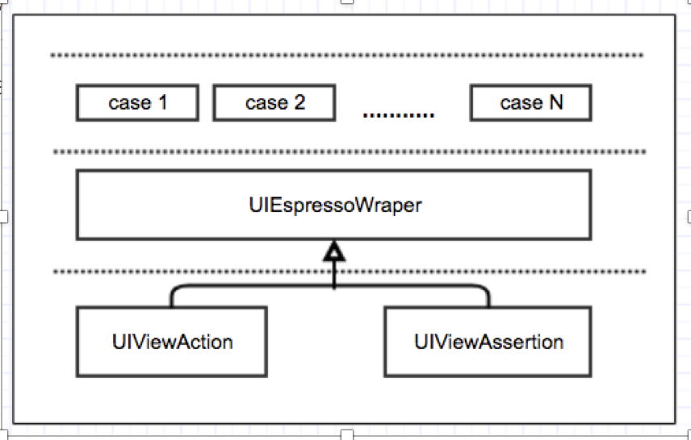

# espressoUI
custom UI Espresso Automation architecture and private viewAction and viewMatcher 
# UI Automator and Espresso
Current Android project provide [UI Automation][] and [Espresso][] framework for UI test 
while the former focus on one single app behaviour and 
the latter focus on cross-app functional UI testing across system and installed apps.

[UI Automation]: https://developer.android.com/training/testing/ui-automator.html
[Espresso]: https://developer.android.com/training/testing/espresso/index.html

# Test Code Layer
It's necessary to at least seperate user interaction logic from detailed view operations. 
So the fisrt thing is to define all atmotic view action and view assertions , 
then wrapped them to provider a interface for high level use . 
The last thing is to write every test case step one by one using wrapped api . 

